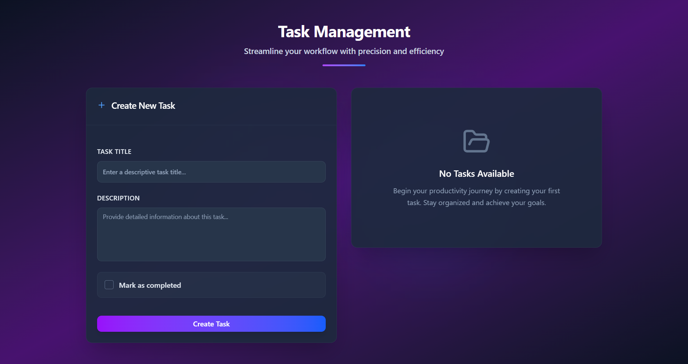
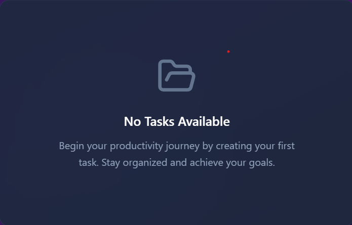
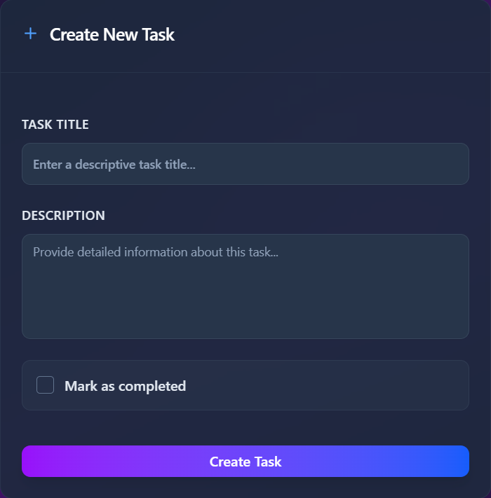

# TaskVault - Full Stack Task Management Application



## Overview
TaskVault is a modern task management application built with a React frontend and Node.js/Express backend. It allows users to create, read, update, and delete tasks with a clean, responsive interface and smooth animations.

## Tech Stack

### Frontend
- React 19
- Vite
- Tailwind CSS
- GSAP (animations)
- Axios (API requests)
- Sonner (toast notifications)

### Backend
- Node.js
- Express
- MongoDB (via Mongoose)
- Joi (validation)
- Express Rate Limit
- CORS

## Features
- Create, view, update, and delete tasks
- Mark tasks as completed
- Responsive design
- Form validation
- Smooth animations and transitions
- Toast notifications for user feedback
- API rate limiting for security

## Screenshots



## Setup Instructions

### Prerequisites
- Node.js (v16+)
- MongoDB (local or Atlas)
- Git

### Clone the Repository
```bash
git clone https://github.com/kaushik-2318/taskvault.git
cd taskvault
```

### Backend Setup
1. Navigate to the server directory:
```bash
cd server
```

2. Install dependencies:
```bash
npm install
```

3. Create a `.env` file in the server directory with the following variables:
```
MONGO_URI=your_mongodb_connection_string
PORT=3000
```

4. Start the server:
```bash
node index.js
```
The server will run on http://localhost:3000

### Frontend Setup
1. Navigate to the frontend directory:
```bash
cd frontend
```

2. Install dependencies:
```bash
npm install
```

3. Create a `.env` file in the frontend directory:
```
VITE_API_BASE_URL=http://localhost:3000/api
```

4. Start the development server:
```bash
npm run dev
```
The frontend will run on http://localhost:5173

## API Documentation

### Endpoints

| Method | Endpoint | Description |
|--------|----------|-------------|
| GET | /api/tasks | Fetch all tasks |
| GET | /api/tasks/:id | Get a specific task |
| POST | /api/tasks | Create a new task |
| PUT | /api/tasks/:id | Update a task |
| DELETE | /api/tasks/:id | Delete a task |

### Sample Requests

#### Create Task
```bash
curl -X POST http://localhost:3000/api/tasks \
  -H "Content-Type: application/json" \
  -d '{
    "title": "Complete project documentation",
    "description": "Write comprehensive README for the TaskVault project",
    "completed": false
  }'
```

#### Get All Tasks
```bash
curl -X GET http://localhost:3000/api/tasks
```

#### Update Task
```bash
curl -X PUT http://localhost:3000/api/tasks/task_id_here \
  -H "Content-Type: application/json" \
  -d '{
    "title": "Updated task title",
    "description": "Updated description",
    "completed": true
  }'
```

#### Delete Task
```bash
curl -X DELETE http://localhost:3000/api/tasks/task_id_here
```

## Data Model

### Task
```javascript
{
  _id: ObjectId,
  title: String,
  description: String,
  completed: Boolean,
  createdAt: Date,
  updatedAt: Date
}
```

## Security & Validation
- Input validation using Joi
- Rate limiting to prevent abuse
- CORS configuration for secure cross-origin requests
- MongoDB sanitization to prevent injection attacks

## Deployment
The application can be deployed using various platforms:

### Backend
- Heroku
- Railway
- Render
- AWS EC2

### Frontend
- Vercel
- Netlify
- GitHub Pages
- Firebase Hosting

## Contributing
1. Fork the repository
2. Create your feature branch (`git checkout -b feature/amazing-feature`)
3. Commit your changes (`git commit -m 'Add some amazing feature'`)
4. Push to the branch (`git push origin feature/amazing-feature`)
5. Open a Pull Request

## License
This project is licensed under the MIT License.

## Author
Kaushik Verma - [GitHub Profile](https://github.com/kaushik-2318)

## Acknowledgments
- [React](https://reactjs.org/)
- [Express](https://expressjs.com/)
- [MongoDB](https://www.mongodb.com/)
- [Tailwind CSS](https://tailwindcss.com/)
- [GSAP](https://greensock.com/gsap/)
